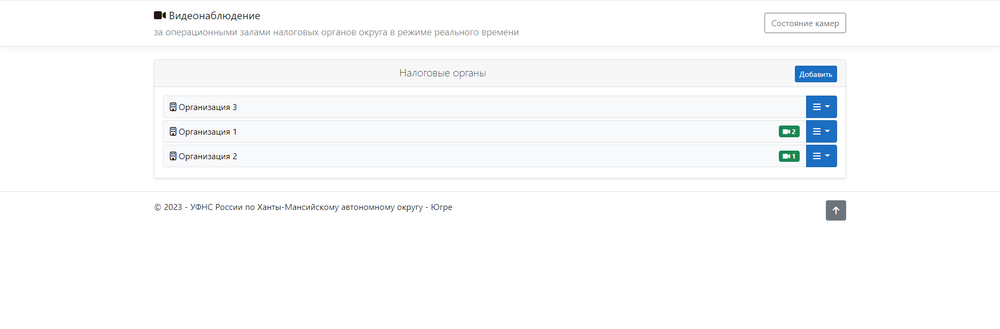
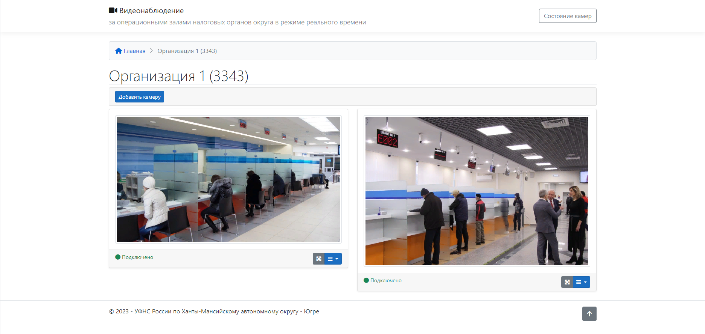
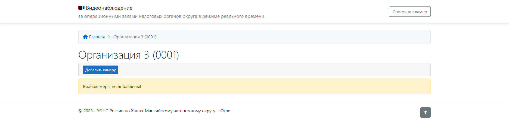
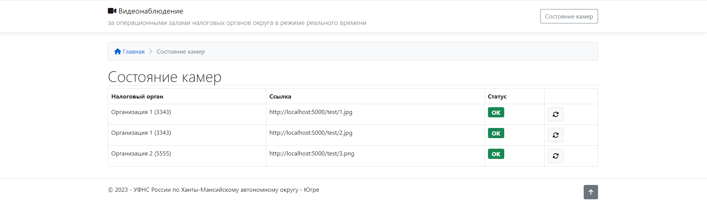
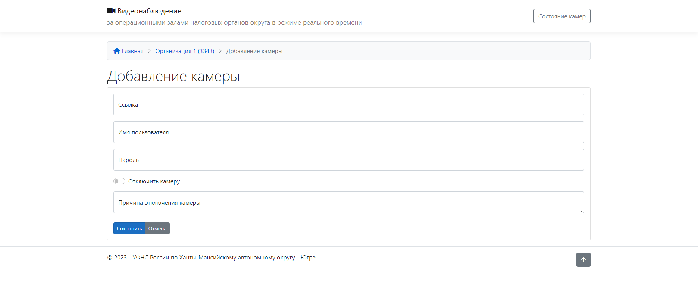

# WebAppVideoCamersOperzal

## Описание
Видеонаблюдение за операционными залами в режиме реального времени.

При переходе на страницу просмотра камер организации происходит обновление изображений с видео-камеры через заданный интервал времени (по умолчанию 5 секунд).

### Скриншоты

## Требования
- Настроить IIS
- Установить Net Framework
- Установить Asp.Net Core Runtime

## Настройки
> ### Файл appsettings.json
> ---
> ``ConnectionStrings.Default`` - строка подключения SQLite (по умолчанию `"Data Source=../db/base.db"`) \
> ``GetUrlFromCameraInterval`` - Периодичность обновления изображения с видео-камеры (мс) (по умолчанию 5000) \
> `AllowedRoles.Roles` - перечень ролей с правами администратор (редактирование организаций, редактирование камер) \
> &nbsp;